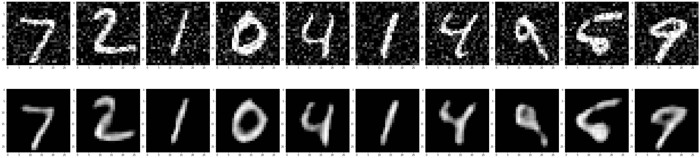
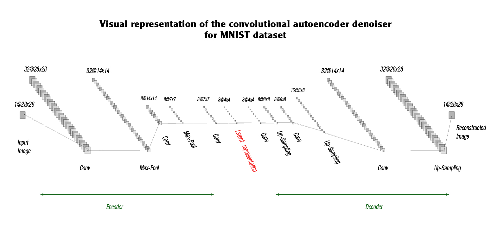

# Autoencoder Digit Image Denoiser



## Overview

The goal of this project is to build an autoencoder model that can denoise images of handwritten digits from the MNIST dataset. The model takes noisy images as input and attempts to reconstruct the original clean images. The denoising process is accomplished by training the autoencoder on the noisy data and the corresponding clean images.

## Table of Contents

- [Introduction](#introduction)
- [Dependencies](#dependencies)
- [Installation](#installation)
- [Usage](#usage)
- [Model Architecture](#model-architecture)
- [Training](#training)
- [Evaluation](#evaluation)
- [Prediction](#prediction)
- [Visualizations](#visualizations)
- [Note](#note)
- [Contributing](#contributing)
- [License](#license)

## Introduction

The MNIST dataset is a well-known dataset of handwritten digits, consisting of 28x28 grayscale images. To simulate a real-world scenario, the images are corrupted with Gaussian noise. The autoencoder model is trained to denoise these noisy images and reconstruct the original digits, effectively removing the noise.

## Dependencies

To run this project, you need the following libraries:

- `tensorflow`: Deep learning framework for building and training the autoencoder model.
- `numpy`: For numerical operations on arrays.
- `matplotlib`: For data visualization.

## Installation

To run the project, follow these steps:

1. Clone this repository to your local machine:

```bash
git clone https://github.com/RayaneKimo/Convolutional_Autoencoder.git
cd Convolutional_Autoencoder
```

2. Make sure you have the required dependencies installed. You can install them using `pip`:

```bash
pip install tensorflow numpy matplotlib
```

3. Optionally, if you want to use Google Colab, you can mount your Google Drive by following the code provided in the notebook.

## Usage

To use the autoencoder digit image denoiser, follow these steps:

1. Load the MNIST dataset and preprocess it. The dataset will be split into training and testing sets. The pixel values of the images are normalized between 0 and 1.

2. Add Gaussian noise to the training and testing images.

3. Build and compile the autoencoder model. The model architecture includes convolutional and upsampling layers for the encoder and decoder, respectively.

4. Train the model on the noisy images to learn to denoise them. The loss function used for training is mean squared error, and the optimizer is Adam with a default learning rate of 0.001.

5. Evaluate the trained model on the testing set to assess its denoising performance.

6. Optionally, use the trained model to denoise individual test images or the entire test set.

## Model Architecture



### Encoder:

- Input shape: (28, 28, 1)
- Convolutional Layer 1: 32 filters, kernel size (3, 3), activation ReLU, padding same
- MaxPooling Layer 1: pool size (2, 2), padding same
- Convolutional Layer 2: 8 filters, kernel size (3, 3), activation ReLU, padding same
- MaxPooling Layer 2: pool size (2, 2), padding same
- Convolutional Layer 3: 8 filters, kernel size (3, 3), activation ReLU, padding same
- MaxPooling Layer 3: pool size (2, 2), padding same

### Decoder:

- Convolutional Layer 4: 8 filters, kernel size (3, 3), activation ReLU, padding same
- Upsampling Layer 1: upsampling factor (2, 2)
- Convolutional Layer 5: 8 filters, kernel size (3, 3), activation ReLU, padding same
- Upsampling Layer 2: upsampling factor (2, 2)
- Convolutional Layer 6: 32 filters, kernel size (3, 3), activation ReLU
- Upsampling Layer 3: upsampling factor (2, 2)
- Convolutional Layer 7: 1 filter, kernel size (3, 3), activation ReLU, padding same

## Training

The model is trained on the noisy training images for 10 epochs using batch size 256 and shuffling the data.

## Evaluation

The model is evaluated on the noisy testing images, and the mean squared error is used as the evaluation metric.

## Prediction

You can use the trained model to denoise individual test images or the entire test set. If you want to denoise a single image, you need to expand its dimension to a batch with only one image (shape: (1, 28, 28, 1)).

## Visualizations

The denoising results are visualized using matplotlib. The figure includes rows for the original noisy images and the corresponding denoised images.

## Note

When using the model for prediction, it is essential to provide the input with the correct shape. If denoising a single image, expand its dimension to a batch with only one image using `np.expand_dims(one_image, axis=0)`.

## Contributing

Contributions to the project are welcome! If you have any suggestions, bug fixes, or new features to add, please feel free to submit a pull request.

Feel free to experiment and modify the code to suit your specific requirements. If you have any questions or encounter any issues, please don't hesitate to reach out.

Happy denoising! 🚀
